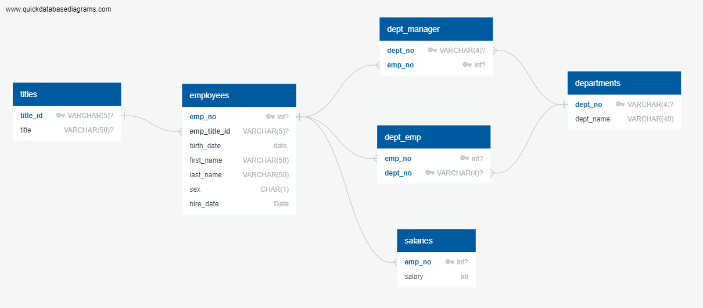

<video controls src="../Navy Blue Animated Project Readme Video.mp4" title="Title"></video>

# Postgres SQL Employee Database Analysis

## Project Overview

This project involves the creation and analysis of a relational database designed to manage employee data using SQL. The Postgres SQL database includes tables for employees, their salaries, departments, titles, and department managers. The primary objective is to efficiently store, manage, and retrieve employee-related data for various analytical purposes, showcasing the use of SQL for database design, data manipulation, and querying.

## Database Structure

The database consists of six main tables:

- **Titles**: Stores information about job titles.
- **Departments**: Contains department names.
- **Employees**: Holds personal details of employees.
- **Salaries**: Records the salary information for employees.
- **Dept_Manager**: Tracks which employees manage which departments.
- **Dept_Emp**: Maps employees to the departments they belong to.

## Database Schema

The diagram above illustrates the relationships between the tables in the database. It shows how tables are connected through foreign keys, ensuring referential integrity and enabling complex queries across the dataset.

## Project Analysis

This project demonstrates the effective design of a normalized relational database, focusing on the creation of tables and the establishment of relationships using foreign keys. The database design supports efficient querying and data manipulation, facilitating various types of analysis, such as retrieving employee information, analyzing salary distributions, and understanding department structures.

### Key Learnings

- **SQL Database Design**: Emphasizes the importance of well-designed database tables for maintaining data integrity and enabling efficient queries.
- **Foreign Key Relationships**: Highlights the role of foreign keys in establishing and enforcing relationships between different tables, which is crucial for maintaining consistency in a relational database.
- **Data Integrity**: Shows how to enforce data integrity within tables through constraints like `CHECK`, ensuring that only valid data is stored.

### Challenges and Considerations

- **Normalization**: Ensuring that the database is properly normalized to avoid redundancy and ensure data integrity, while still supporting efficient data retrieval.
- **Query Performance**: Balancing the benefits of normalization with the need for efficient querying, especially when dealing with large datasets.

## Next Steps

- **Data Analysis**: Conduct deeper analysis on the employee data, such as identifying trends in salary changes over time or assessing department growth.
- **Optimization**: Explore opportunities to optimize the database, such as by creating indexes, to enhance query performance, particularly for large datasets.

## Contributors

- [Your Name](https://github.com/yourusername) - Project development and analysis.

## Credits and Sources

- [QuickDBD](https://www.quickdatabasediagrams.com/) - Used for generating the database schema diagram.
- [ChatGPT 4.0] - Used for debugging and coding examples help. 
- [Github Copilot] - Used for helping with de-bugging. 
